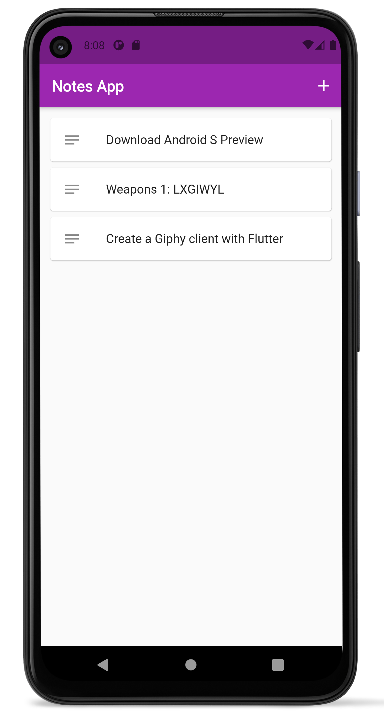

# notes

## Getting Started with Flutter

Learning Flutter in practice - Challenge 1: a simple notes app

### Goals
- Basics of Flutter UI
- Store and retrieve simple data

___
[Challenge 2: Giphy client app](https://github.com/luandersonn/gif-search-flutter)
